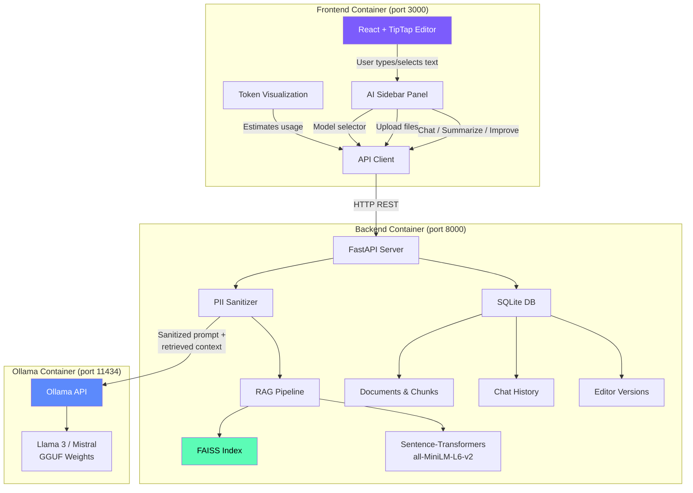
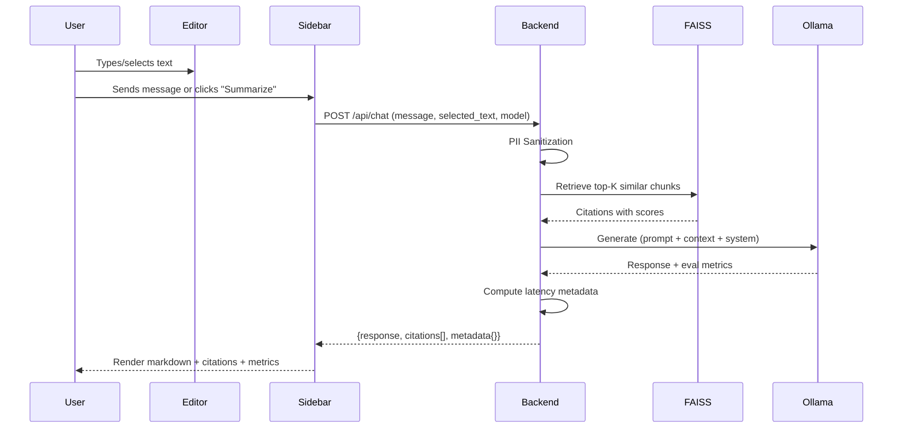
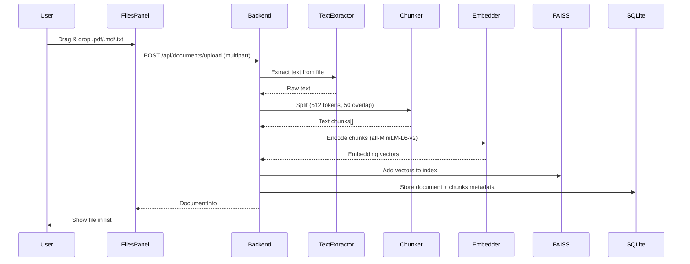

# Architecture — Loomin-Docs

## System Overview

## Data Flow — Chat with RAG

## Data Flow — File Upload & Indexing

## Container Architecture

| Service | Image | Port | Volume |
|---------|-------|------|--------|
| Frontend | `loomin-frontend` (nginx) | 3000 | — |
| Backend | `loomin-backend` (Python 3.11) | 8000 | `backend-data` (SQLite + FAISS) |
| Ollama | `ollama/ollama` | 11434 | `ollama-models` (GGUF weights) |

All three containers share the `loomin-net` bridge network. The frontend nginx proxies `/api/*` to the backend.
